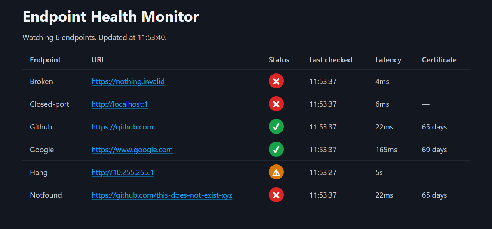

# endpoint-health-monitor

[](https://github.com/anis-mahsoume/endpoint-health-monitor/actions/workflows/ci.yml)

A lightweight Go service that monitors HTTP(S) endpoints and reports their status, response time and TLS certificate expiry, through a REST API and a small web dashboard.



## Features

- Checks endpoints concurrently with a configurable number of workers
- Runs a check round on a fixed interval until the process is stopped
- Applies a per-request timeout, so a hanging server can't block a round
- Measures response latency
- Reads the TLS certificate expiry date for HTTPS endpoints
- Classifies each check as `up`, `timeout`, `error` (DNS failure, connection refused, TLS problem) or `bad_status` (status code outside 2xx/3xx)
- Keeps the last 20 results per endpoint in memory
- Marks an endpoint `down` after 3 consecutive failures, and records when the failure streak started
- REST API to list statuses, read history, and add or remove endpoints
- Optional API key protection for the write routes
- Web dashboard with a status icon per endpoint; hover it for the down time and last error. Refreshes every 5 seconds
- Graceful shutdown on Ctrl+C

## Quick start

Requires Go 1.27 or newer.

```bash
git clone https://github.com/anis-mahsoume/endpoint-health-monitor.git
cd endpoint-health-monitor
go run ./cmd/monitor
```

The service checks a few built-in endpoints (hardcoded in `cmd/monitor/main.go`) right away, then once per interval. Open the dashboard at http://localhost:8080, or query the API:

```bash
curl http://localhost:8080/api/v1/status
```

The dashboard is styled with [Pico CSS](https://picocss.com), loaded from a CDN. Without internet access the page still works, just unstyled.

### Flags

| Flag        | Default | Description                 |
|-------------|---------|-----------------------------|
| `-addr`     | `:8080` | HTTP listen address         |
| `-workers`  | `10`    | number of concurrent checks |
| `-timeout`  | `5s`    | per-check timeout           |
| `-interval` | `10s`   | time between check rounds   |

### Environment variables

| Variable  | Description |
|-----------|-------------|
| `API_KEY` | If set, `POST` and `DELETE` requests must send it in the `X-API-Key` header. If not set, those routes are open and a warning is logged at startup. |

## API

All routes are under `/api/v1`. Errors are returned as `{"error": "..."}`.

| Method   | Route                    | Auth    | Description |
|----------|--------------------------|---------|-------------|
| `GET`    | `/status`                | none    | Current status of every endpoint, sorted by ID |
| `GET`    | `/endpoints/:id/history` | none    | Recent check results for one endpoint, newest first |
| `POST`   | `/endpoints`             | API key | Add an endpoint. Body: `{"id": "...", "url": "https://..."}` |
| `DELETE` | `/endpoints/:id`         | API key | Stop watching an endpoint and drop its history |

Each endpoint in `/status` has one of these statuses:

| Status    | Meaning |
|-----------|---------|
| `pending` | not checked yet |
| `up`      | the latest check succeeded |
| `failing` | failed recently, but fewer than 3 times in a row |
| `down`    | failed 3 or more times in a row; `down_since` is when the streak started |

Example `/status` response (trimmed):

```json
{
  "endpoints": [
    {
      "id": "Broken",
      "url": "https://nothing.invalid",
      "status": "down",
      "consecutive_failures": 3,
      "down_since": "2026-09-24T10:00:00Z",
      "last_check": {
        "checked_at": "2026-09-24T10:01:00Z",
        "outcome": "error",
        "latency_ms": 5,
        "error": "..."
      }
    }
  ]
}
```

### Examples

Start the service with an API key, e.g. `API_KEY=secret go run ./cmd/monitor` (bash) or `$env:API_KEY = "secret"; go run ./cmd/monitor` (PowerShell), and set the same variable in the shell you send requests from.

**bash / curl**

```bash
# List every endpoint's status
curl http://localhost:8080/api/v1/status

# Recent results for one endpoint
curl http://localhost:8080/api/v1/endpoints/Github/history

# Add an endpoint
curl -X POST http://localhost:8080/api/v1/endpoints \
  -H "Content-Type: application/json" \
  -H "X-API-Key: $API_KEY" \
  -d '{"id": "example", "url": "https://example.com"}'

# Remove it
curl -X DELETE http://localhost:8080/api/v1/endpoints/example \
  -H "X-API-Key: $API_KEY"
```

**PowerShell**

```powershell
# List every endpoint's status
Invoke-RestMethod http://localhost:8080/api/v1/status | ConvertTo-Json -Depth 5

# Recent results for one endpoint
Invoke-RestMethod http://localhost:8080/api/v1/endpoints/Github/history | ConvertTo-Json -Depth 5

# Add an endpoint
Invoke-RestMethod -Method Post http://localhost:8080/api/v1/endpoints `
  -Headers @{ "X-API-Key" = $env:API_KEY } `
  -ContentType "application/json" `
  -Body '{"id": "example", "url": "https://example.com"}'

# Remove it
Invoke-RestMethod -Method Delete http://localhost:8080/api/v1/endpoints/example `
  -Headers @{ "X-API-Key" = $env:API_KEY }
```

## Testing

```bash
go test ./...
```

## Project structure

```
cmd/monitor/         entry point: flags, seed endpoints, scheduler, graceful shutdown
internal/server/     builds the HTTP handler: global middleware, mounts the API and dashboard
internal/api/        JSON API under /api/v1: handlers, API key middleware, response types
internal/dashboard/  HTML dashboard at /: page data and the embedded template
internal/checker/    single-endpoint checks and the concurrent worker pool
internal/scheduler/  runs a check round on a fixed interval
internal/store/      in-memory endpoint list, result history, down detection and status rule
```
